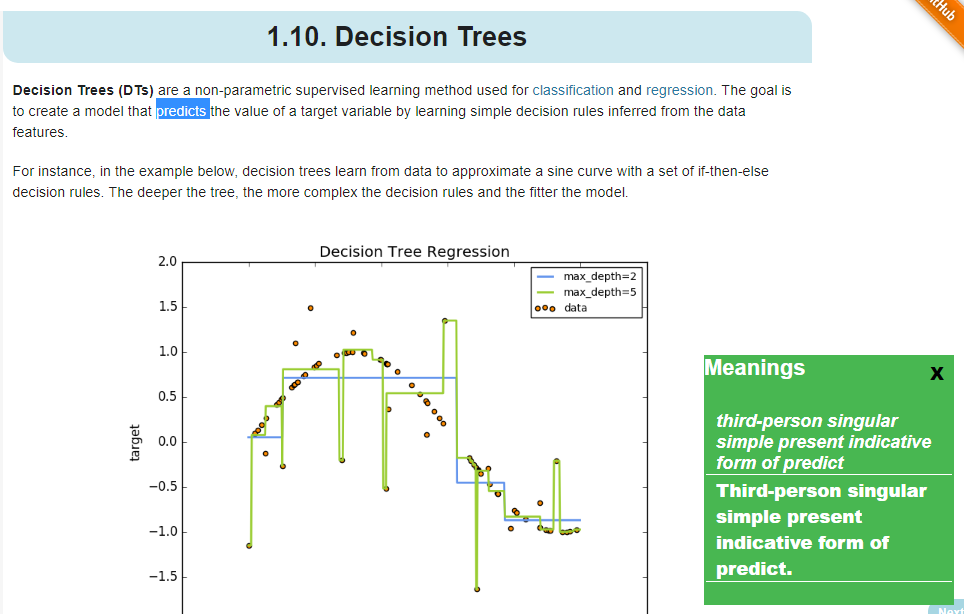
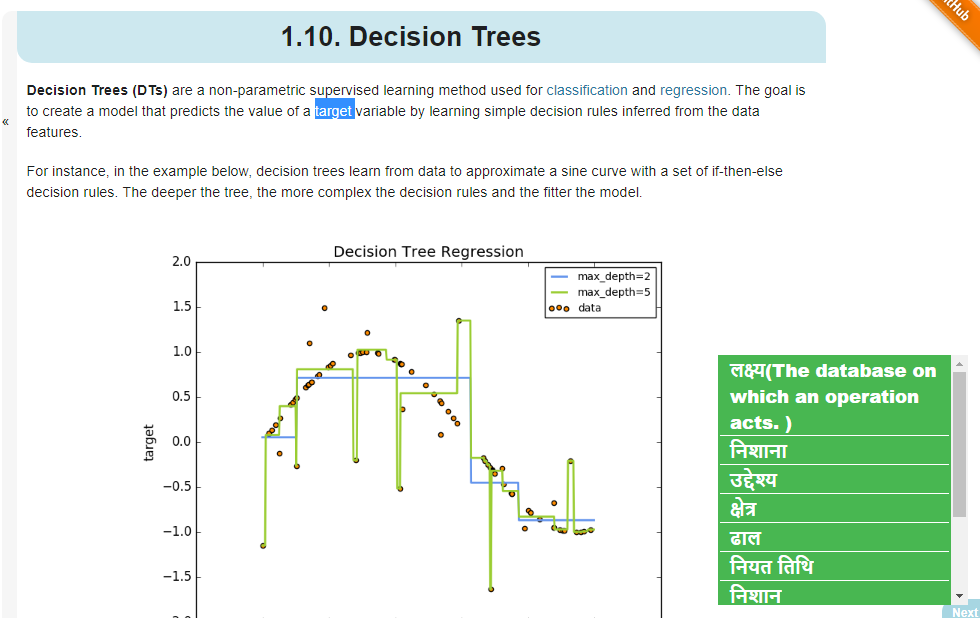

# dictionary-extension

<h2> dictionary-extension </h2

This is a chrome extension which tell the meaning of English word on your page..

Only select the text you want to find the meaning of and press CTRL + SHIFT to see the meaning..

You can also drag this meaning box in the page where ever you want..

